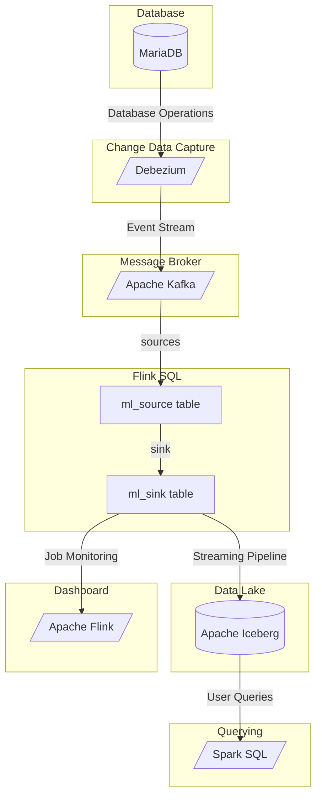
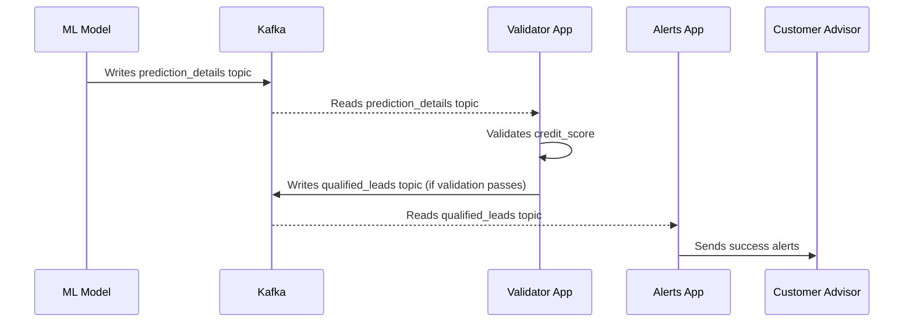

# Solution Architecture

Below is the overall architecture of this event-driven, CDC-based, streaming 
data pipeline.

# Feature Design

Below is a sequence diagram for the feature that is going to be implemented.

