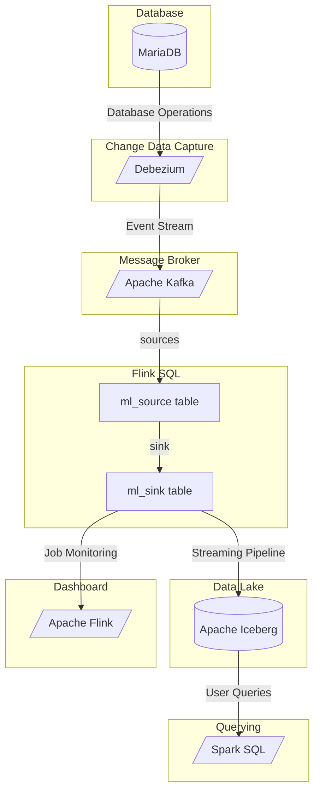

# Solution Architecture

Below is the overall architecture of this event-driven, CDC-based, streaming 
data pipeline.

```mermaid
%% Solution Architecture Diagram
graph TD
    subgraph "Database"
        A[("MariaDB")]
    end

    subgraph "Change Data Capture"
        B[/"Debezium"/]
    end

    subgraph "Message Broker"
        C[/"Apache Kafka"/]
    end

    subgraph "Flink SQL"
        D["ml_source table"]
        E["ml_sink table"]
    end

    subgraph "Data Lake"
        F[("Apache Iceberg")]
    end

    subgraph "Dashboard"
        G[/"Apache Flink"/]
    end

    subgraph "Querying"
        H[/"Spark SQL"/]
    end

    A --"Database Operations"--> B
    B --"Event Stream"--> C
    C --"sources"--> D
    D --"sink"--> E
    E --"Streaming Pipeline"--> F
    F --"User Queries" --> H
    E --"Job Monitoring" --> G
```